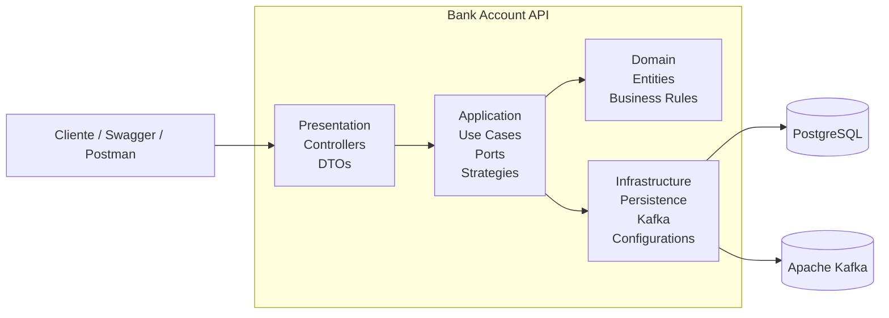
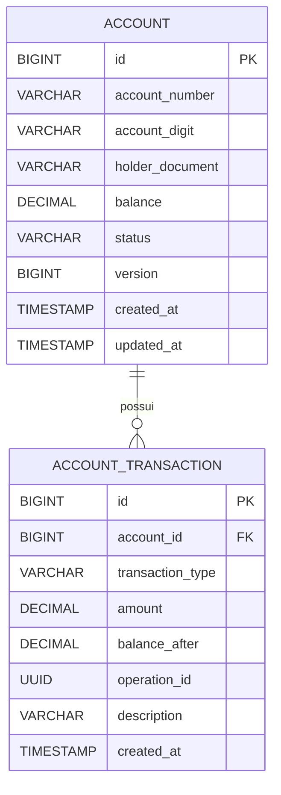

# 💳 Bank Account API


API REST para gerenciamento de contas bancárias desenvolvida como solução para um desafio técnico, com foco em arquitetura de software, boas práticas de desenvolvimento e escalabilidade.

A aplicação foi construída utilizando **Java 21** e **Spring Boot 3**, seguindo princípios de **Clean Architecture** e **Ports & Adapters (Arquitetura Hexagonal)**, mantendo as regras de negócio desacopladas dos detalhes de infraestrutura.

Além dos requisitos funcionais propostos, a solução foi projetada considerando aspectos importantes para sistemas financeiros, como consistência transacional, controle de concorrência, rastreabilidade das operações, processamento assíncrono de eventos e preparação para execução em ambientes containerizados com Kubernetes.

---

# 🎯 Objetivos do Projeto

Este projeto foi desenvolvido com os seguintes objetivos:

* Construir uma API REST para operações bancárias.
* Aplicar boas práticas de arquitetura e design de software.
* Demonstrar separação de responsabilidades entre as camadas da aplicação.
* Garantir consistência e integridade dos dados durante operações financeiras.
* Explorar processamento assíncrono utilizando Apache Kafka.
* Disponibilizar uma aplicação pronta para execução em Docker e Kubernetes.

---

# ✨ Funcionalidades

A API disponibiliza os seguintes serviços:

* ✅ Abertura de conta corrente
* ✅ Depósito
* ✅ Saque
* ✅ Transferência entre contas
* ✅ Consulta de extrato com paginação
* ✅ Consulta de detalhamento de uma operação
* ✅ Processamento assíncrono de eventos utilizando Kafka
* ✅ Controle de concorrência para operações financeiras

---

# 🛠️ Tecnologias Utilizadas

| Tecnologia        | Versão |
| ----------------- | ------ |
| Java              | 21     |
| Spring Boot       | 3.5.x  |
| Spring Web        | 6.x    |
| Spring Data JPA   | 3.5.x  |
| Hibernate         | 6.x    |
| PostgreSQL        | 16     |
| Apache Kafka      | Latest |
| Flyway            | Latest |
| Maven             | 3.9+   |
| Docker            | Latest |
| Kubernetes        | Latest |
| Podman            | Latest |
| SpringDoc OpenAPI | Latest |
| JUnit 5           | Latest |

---

# 🏗️ Arquitetura Geral

A aplicação foi estruturada utilizando princípios de **Clean Architecture**, organizando as responsabilidades em camadas independentes para reduzir o acoplamento entre regras de negócio e tecnologias externas.

A comunicação entre as camadas ocorre por meio de abstrações (Ports), permitindo que detalhes como persistência, mensageria e frameworks permaneçam isolados da lógica de negócio.

Essa abordagem torna a aplicação mais:

* ✔ Testável
* ✔ Extensível
* ✔ Escalável
* ✔ Fácil de manter
* ✔ Independente de frameworks

A figura abaixo apresenta uma visão de alto nível da arquitetura da solução.

<p align="center">

</p>

---

## Visão Geral da Solução



A arquitetura foi organizada para que as regras de negócio permaneçam independentes dos mecanismos de persistência, mensageria e demais detalhes técnicos.

Dessa forma, a camada de domínio concentra apenas o comportamento do negócio, enquanto as integrações com banco de dados, Apache Kafka e demais tecnologias ficam isoladas na camada de infraestrutura, respeitando o princípio da inversão de dependência (Dependency Inversion Principle).


# 🏛️ Arquitetura da Aplicação

A aplicação foi organizada seguindo os princípios da **Clean Architecture**, distribuindo as responsabilidades em camadas bem definidas e independentes.

Cada camada possui uma responsabilidade específica e se comunica apenas através de contratos bem definidos, reduzindo o acoplamento entre regras de negócio e detalhes de infraestrutura.

A estrutura principal do projeto é composta pelas seguintes camadas:

```text
br.com.rafaelb.bankaccount
│
├── application
├── domain
├── infrastructure
├── presentation
└── resources
```

O objetivo dessa organização é garantir que a lógica de negócio permaneça independente de frameworks, banco de dados e mecanismos de comunicação externa.

---

# 📦 Presentation

A camada **Presentation** representa a porta de entrada da aplicação.

É responsável exclusivamente pela comunicação HTTP, recebendo requisições REST, realizando validações de entrada, convertendo DTOs e delegando o processamento para os casos de uso da camada de aplicação.

Ela não contém regras de negócio.

```text
presentation
├── controller
├── request
├── response
└── validation
```

### Responsabilidades

* Exposição da API REST
* Validação das requisições
* Conversão entre DTOs e objetos da aplicação
* Definição dos contratos HTTP
* Documentação OpenAPI (Swagger)

---

# ⚙️ Application

A camada **Application** implementa os casos de uso da aplicação.

Ela coordena o fluxo das operações, orquestrando as regras de negócio presentes no domínio e utilizando abstrações (Ports) para acessar recursos externos.

Essa camada conhece o domínio, mas não conhece detalhes de persistência, mensageria ou frameworks.

```text
application
├── event
├── exception
├── mapper
├── ports
├── strategy
└── usecase
```

### Responsabilidades

* Implementação dos casos de uso
* Orquestração das operações
* Definição das interfaces (Ports)
* Publicação de eventos da aplicação
* Conversão entre objetos de domínio e DTOs
* Estratégias de processamento

---

# 🧠 Domain

O **Domain** representa o núcleo da aplicação.

É a camada mais importante do projeto e concentra todas as regras de negócio.

As entidades encapsulam seu próprio comportamento, evitando que regras críticas fiquem espalhadas entre controllers ou serviços.

```text
domain
├── enums
├── exception
└── model
```

### Responsabilidades

* Entidades de domínio
* Regras de negócio
* Exceções de domínio
* Enumerações
* Contratos dos repositórios

Por exemplo, comportamentos como:

* depósito
* saque
* validação de saldo
* validação de valores

permanecem dentro das entidades, tornando o domínio autocontido e independente das demais camadas.

> **Observação**
>
> Embora os repositórios estejam completamente desacoplados através de Ports, as entidades de domínio também são utilizadas como entidades JPA.
>
> Em um ambiente de produção seria recomendável separar os modelos de domínio das entidades de persistência, eliminando completamente a dependência do JPA no domínio.
>
> Para este desafio técnico optou-se por utilizar uma única representação das entidades, reduzindo a complexidade da solução e evitando duplicação de código sem comprometer a organização arquitetural.

---

# 🏗️ Infrastructure

A camada **Infrastructure** concentra todos os detalhes técnicos da aplicação.

É nela que ficam as implementações das abstrações definidas pelas demais camadas, como persistência, mensageria, configurações do Spring e integrações externas.

```text
infrastructure
├── configuration
├── exception
├── messaging
│   └── kafka
├── persistence
```

### Responsabilidades

* Implementação dos repositórios
* Configurações do Spring Boot
* Configuração do Kafka
* Persistência utilizando Spring Data JPA
* Tratamento global de exceções
* Validações técnicas
* Integrações externas

Essa camada depende das abstrações definidas pela aplicação e pelo domínio, nunca o contrário.

---

# 🔌 Ports & Adapters

Um dos principais objetivos da arquitetura foi desacoplar a lógica de negócio das tecnologias utilizadas pela aplicação.

Para isso, foi adotado o padrão **Ports & Adapters**, onde os casos de uso dependem apenas de interfaces (Ports), enquanto suas implementações concretas permanecem isoladas na camada de infraestrutura.

O fluxo de dependência ocorre da seguinte forma:

```text
                Presentation
                      │
                      ▼
               Application
                      │
          (Ports / Interfaces)
                      │
                      ▼
          Infrastructure (Adapters)
                      │
                      ▼
          PostgreSQL / Kafka / Spring
```

Com essa abordagem:

* os casos de uso não conhecem o Spring Data JPA;
* o domínio permanece desacoplado dos mecanismos de persistência;
* a infraestrutura pode evoluir sem impactar as regras de negócio;
* a aplicação torna-se mais simples de testar, uma vez que as dependências podem ser facilmente substituídas por implementações em memória ou mocks.

Essa separação segue o princípio da **Inversão de Dependência (Dependency Inversion Principle)**, onde módulos de alto nível dependem de abstrações, e não de implementações concretas.

---

# 🔄 Fluxo entre as Camadas

A aplicação foi projetada para suportar diferentes estratégias de processamento das operações financeiras.

Por meio do padrão **Strategy**, é possível definir se uma operação será executada de forma **síncrona** ou **assíncrona**, sem alterar a implementação dos casos de uso.

## Processamento Síncrono

```text
Cliente
    │
    ▼
REST Controller
    │
    ▼
Processing Strategy
    │
    ▼
Application Use Case
    │
    ▼
Domain
    │
    ▼
Repository (Port)
    │
    ▼
Repository Adapter
    │
    ▼
PostgreSQL
```

---

## Processamento Assíncrono

```text
Cliente
    │
    ▼
REST Controller
    │
    ▼
Processing Strategy
    │
    ▼
Kafka Producer
    │
    ▼
Apache Kafka
    │
    ▼
Kafka Consumer
    │
    ▼
Application Use Case
    │
    ▼
Domain
    │
    ▼
Repository (Port)
    │
    ▼
Repository Adapter
    │
    ▼
PostgreSQL
```

Em ambos os cenários, toda a regra de negócio permanece concentrada nos **Use Cases** da camada de aplicação.

A diferença está apenas na estratégia utilizada para iniciar o processamento da operação.

Essa abordagem oferece flexibilidade para escolher entre execução síncrona ou orientada a eventos, mantendo a arquitetura desacoplada e permitindo que novas estratégias sejam adicionadas no futuro sem alterações significativas nas regras de negócio.


# 🗄️ Modelo de Dados

A aplicação utiliza um modelo de persistência simples, porém adequado para sistemas financeiros, separando o estado atual da conta do histórico de movimentações.

O banco de dados é composto por duas entidades principais.



---

## Account

A entidade **Account** representa o estado atual da conta bancária.

Ela armazena apenas as informações necessárias para o funcionamento da conta:

* Identificador da conta
* Número da conta
* Dígito verificador
* Documento do titular
* Saldo atual
* Status da conta
* Controle de versão
* Datas de criação e atualização

O saldo disponível é sempre atualizado durante operações financeiras, permitindo consultas rápidas sem necessidade de recalcular todo o histórico.

---

## AccountTransaction

A entidade **AccountTransaction** implementa um modelo baseado em **Ledger**.

Cada movimentação financeira gera um novo registro imutável, preservando todo o histórico da conta.

Esse modelo oferece diversas vantagens:

* Histórico completo das operações
* Rastreabilidade
* Auditoria
* Emissão de extratos
* Recuperação do histórico financeiro
* Agrupamento de movimentações por operação

Cada registro contém:

* Conta relacionada
* Tipo da movimentação
* Valor movimentado
* Saldo após a operação
* Identificador único da operação (`operationId`)
* Data da movimentação

---

# 🔒 Controle de Concorrência

Operações financeiras exigem consistência durante atualizações de saldo.

Para impedir que duas transações alterem simultaneamente a mesma conta, foi adotado bloqueio pessimista utilizando **PESSIMISTIC_WRITE**.

O fluxo ocorre da seguinte forma:

```text
Transação A
      │
      ▼
Bloqueia Conta
      │
      ▼
Atualiza Saldo
      │
      ▼
Commit
      │
      ▼
Libera Lock
```

Enquanto uma transação estiver processando determinada conta, outras operações que tentarem alterar o mesmo registro deverão aguardar a liberação do bloqueio.

Essa estratégia evita problemas clássicos como:

* Lost Update
* Dirty Write
* Race Conditions durante atualização de saldo

---

## Controle de Versão

Além do bloqueio pessimista, a entidade `Account` mantém um campo de controle de versão utilizando `@Version`.

Embora atualmente as operações financeiras utilizem bloqueio pessimista, o versionamento foi mantido como uma camada adicional de segurança para futuras evoluções da aplicação.

Essa abordagem permite detectar alterações concorrentes em cenários onde outras operações possam atualizar a entidade sem utilizar bloqueio pessimista.

---

# 🔄 Transações

Todas as operações financeiras são executadas dentro de transações utilizando `@Transactional`.

Essa estratégia garante que operações compostas sejam executadas de forma atômica.

Por exemplo, uma transferência realiza:

1. Débito da conta de origem
2. Crédito da conta de destino
3. Registro das movimentações financeiras

Caso qualquer uma dessas etapas falhe, toda a transação é revertida automaticamente pelo Spring.

Isso garante as propriedades ACID relacionadas à consistência e atomicidade.

---

# 📨 Processamento Assíncrono com Kafka

A aplicação utiliza o **Apache Kafka** como mecanismo de mensageria para o processamento das operações financeiras.

Após o recebimento de uma requisição HTTP, a API publica um evento em um tópico Kafka. Esse evento é consumido de forma assíncrona por um **Kafka Consumer**, responsável por delegar o processamento ao respectivo **Use Case** da aplicação.

Essa abordagem desacopla o recebimento da requisição da execução da regra de negócio, permitindo maior escalabilidade, resiliência e facilidade de integração com outros sistemas.

```text
                 Fluxo Assíncrono

Cliente
    │
    ▼
REST API
    │
    ▼
Kafka Producer
    │
    ▼
────────── Apache Kafka ──────────
                │
                ▼
         Kafka Consumer
                │
                ▼
      Application Use Case
                │
                ▼
             Domain
                │
                ▼
      Repository (Port)
                │
                ▼
     Repository Adapter
                │
                ▼
           PostgreSQL
```

Uma característica importante dessa arquitetura é que o **Kafka Consumer não implementa regras de negócio**. Sua única responsabilidade é consumir o evento e encaminhá-lo ao caso de uso correspondente.

Dessa forma, tanto uma requisição HTTP quanto uma mensagem recebida do Kafka percorrem a mesma camada de aplicação, mantendo a lógica de negócio centralizada e reutilizável.

Essa abordagem facilita a evolução da aplicação para cenários como:

- envio de notificações;
- integração com sistemas externos;
- auditoria;
- geração de relatórios;
- processamento distribuído.

Como os Consumers delegam o processamento aos mesmos **Use Cases** utilizados pela aplicação, novas formas de entrada — como novos tópicos Kafka ou outros mecanismos de mensageria — podem ser adicionadas sem alterar as regras de negócio existentes.

---

# 🏛️ Principais Decisões Arquiteturais

Durante o desenvolvimento do projeto foram adotadas algumas decisões com o objetivo de equilibrar organização, simplicidade e facilidade de evolução.

---

## Clean Architecture

A aplicação foi organizada em camadas independentes, mantendo a lógica de negócio isolada de frameworks e detalhes de infraestrutura.

Essa separação facilita manutenção, testes e evolução da solução.

---

## Strategy Pattern

O processamento das operações financeiras utiliza o padrão **Strategy**, permitindo alternar entre execução síncrona e assíncrona sem alterar a implementação dos casos de uso.

Essa abordagem desacopla a forma como uma operação é iniciada da lógica responsável por executá-la, tornando a aplicação mais flexível e preparada para diferentes cenários de integração.

---

## Ports & Adapters

Os casos de uso dependem apenas de abstrações.

As implementações concretas de persistência e mensageria permanecem na camada de infraestrutura, respeitando o princípio da inversão de dependência.

---

## Domain-Driven Design

As entidades encapsulam seu próprio comportamento.

Operações como depósito, saque e validação de saldo permanecem dentro do domínio, evitando regras espalhadas entre serviços e controllers.

---

## Ledger

O histórico financeiro foi implementado utilizando um modelo de Ledger.

Em vez de atualizar registros existentes, cada operação gera uma nova movimentação imutável, preservando rastreabilidade e auditoria.

---

## Transactional Boundaries

Operações críticas são executadas dentro de uma única transação, garantindo consistência mesmo em cenários de falha.

---

## BigDecimal

Todos os valores monetários utilizam `BigDecimal`, eliminando problemas de precisão inerentes aos tipos de ponto flutuante.

---

## Instant

Datas e horários são persistidos utilizando `Instant`, garantindo armazenamento em UTC e evitando inconsistências relacionadas a fusos horários.

---

## OperationId

Cada operação financeira recebe um identificador único (`UUID`).

Esse identificador permite relacionar todas as movimentações pertencentes à mesma operação de negócio, facilitando detalhamento de uma tansação, rastreabilidade e auditoria.

---

## Trade-offs Adotados

Embora a arquitetura utilize Ports & Adapters para desacoplar persistência e regras de negócio, as entidades de domínio também são utilizadas como entidades JPA.

Em um cenário de produção, uma separação completa entre modelos de domínio e entidades de persistência seria uma alternativa mais aderente à Clean Architecture.

Para este desafio técnico, optou-se por utilizar uma única representação das entidades, reduzindo a complexidade da solução e evitando duplicação de código, sem comprometer a organização arquitetural e a clareza da implementação.


# 🚀 Como Executar o Projeto

A aplicação pode ser executada localmente utilizando Docker ou em um ambiente Kubernetes.

Para facilitar a avaliação do desafio técnico, o fluxo principal da API pode ser executado apenas com PostgreSQL e kafka, permitindo testar todas as operações financeiras através da interface Swagger ou ferramentas como Postman.

---

# 📋 Pré-requisitos

* Java 21+
* Maven 3.9+
* Docker ou Podman
* Kubernetes (opcional)

---

# 💻 Execução Local

## 1. Clonar o projeto

```bash
git clone https://github.com/seu-usuario/bank-account-api.git

cd Bank-Account-Api
```

---

## 2. Subir o banco de dados e o kafka

```bash
docker compose up -d postgres kafka
```

---

## 3. Executar a aplicação

```bash
mvn spring-boot:run
```

A aplicação estará disponível em:

| Serviço | URL                                         |
| ------- | ------------------------------------------- |
| API     | http://localhost:8080                       |
| Swagger | http://localhost:8080/swagger-ui/index.html |

---

# 🐳 Docker

O projeto possui suporte à execução utilizando Docker.

Após gerar o artefato da aplicação:

```bash
mvn clean package -DskipTests
```

Execute:

```bash
docker build -t bank-account-api:latest .
```

ou utilizando Docker Compose:

```bash
docker compose up
```

---

# ☸️ Kubernetes

Além da execução local, a aplicação foi preparada para execução em Kubernetes.

O projeto contém manifests para implantação da infraestrutura básica da aplicação, incluindo:

* Deployment da API
* Deployment do PostgreSQL
* Deployment do kafka
* Services
* Horizontal Pod Autoscaler (HPA)

O deploy pode ser realizado através de:

```bash
kubectl apply -f k8s/
```

Alguns comandos úteis:

```bash
kubectl get pods

kubectl get svc

kubectl get hpa
```

---

## Observações sobre o ambiente Kubernetes

Durante o desenvolvimento do desafio foi realizado um ambiente de testes utilizando Kubernetes local, incluindo configuração de autoscaling através de HPA.

A estrutura de manifests encontra-se disponível no projeto como demonstração da preparação da aplicação para ambientes orquestrados.

Entretanto, o fluxo completo envolvendo **Apache Kafka** em conjunto com Kubernetes exige configurações adicionais de infraestrutura, como definição de listeners, advertised listeners, configuração de Services e resolução de rede entre os containers.

Essas configurações variam de acordo com o ambiente onde o cluster é executado (Docker Desktop, Minikube, Kind, Podman Desktop, entre outros).

Por esse motivo, a demonstração funcional da aplicação será realizada utilizando containers em ambiente local, mantendo toda a arquitetura Kubernetes disponível no repositório como referência de implantação.

---

# 🌐 Endpoints

| Método | Endpoint                              | Descrição                 |
| ------ | ------------------------------------- | ------------------------- |
| POST   | `/accounts`                           | Criação de conta          |
| POST   | `/transactions/deposit`               | Realiza um depósito       |
| POST   | `/transactions/withdrawal`            | Realiza um saque          |
| POST   | `/transactions/transfer`              | Realiza uma transferência |
| GET    | `/accounts/{accountId}/statement`     | Consulta extrato          |
| GET    | `/accounts/{operationId}/transaction` | Consulta uma transação    |

Toda a documentação da API também pode ser acessada através do Swagger.

---

# 📚 Exemplos de Utilização

## 👤 Criar Conta

```http
POST /accounts
```

```json
{
  "accountNumber": "3405417356",
  "accountDigit": "0",
  "holderDocument": "47255303013"
}
```

---

## 💰 Depósito

```http
POST /transactions/deposit
```

```json
{
  "accountId": 1,
  "amount": 100.00
}
```

---

## 💸 Saque

```http
POST /transactions/withdrawal
```

```json
{
  "accountId": 1,
  "amount": 50.00
}
```

---

## 🔁 Transferência

```http
POST /transactions/transfer
```

```json
{
  "fromAccountId": 1,
  "toAccountId": 2,
  "amount": 30.00
}
```

---

## 📄 Consulta de Extrato

```http
GET /accounts/{accountId}/statement
```

Parâmetros disponíveis:

* período inicial (startDate:2026-06-26T23:40:21.274197Z)
* período final (endDate:2026-12-29T23:48:53.425395Z)
* tipo da transação (transactionType:TRANSFER_IN)
* paginação (size: 10, page: 1)

---

## 🧾 Consulta detalhes de uma transação

```http
GET /accounts/{operationId}/transaction
```

O detalhamento retorna as movimentações pertencentes à mesma operação financeira através do `operationId`.

---

# 📈 Escalabilidade

A aplicação foi desenvolvida seguindo o conceito de **Stateless Application**, permitindo a execução de múltiplas réplicas sem compartilhamento de estado entre instâncias.

A consistência dos dados é garantida através da combinação de:

* Transações (`@Transactional`)
* Bloqueio pessimista (`PESSIMISTIC_WRITE`)
* Controle de versão (`@Version`)
* Modelo Ledger para rastreabilidade das operações

Essa abordagem permite que a aplicação evolua para ambientes distribuídos mantendo consistência nas operações financeiras e suporte a estratégias de escalabilidade horizontal.

# 🧪 Testes

A aplicação possui testes automatizados para validar os principais fluxos de negócio e garantir a estabilidade da solução durante futuras evoluções.

Os testes foram organizados em diferentes níveis da aplicação:

| Tipo de Teste | Objetivo |
|---------------|----------|
| Unitários | Validar regras de negócio das entidades e casos de uso |
| Integração | Validar integração entre aplicação e banco de dados |

Os testes contemplam cenários como:

- ✅ Criação de contas
- ✅ Depósitos
- ✅ Saques
- ✅ Transferências
- ✅ Consulta de extrato
- ✅ Consulta de comprovantes
- ✅ Validações de negócio
- ✅ Tratamento de exceções

Para executar todos os testes:

```bash
mvn test
```

---

# 📈 Possíveis Evoluções

Embora o projeto atenda aos requisitos propostos para o desafio técnico, diversas melhorias poderiam ser incorporadas em um ambiente de produção.

## Arquitetura

- Separação completa entre Domain Model e Persistence Entity, eliminando dependências do JPA na camada de domínio.
- Implementação do padrão Outbox para publicação confiável de eventos.
- Introdução de CQRS para separação entre escrita e leitura.
- Versionamento da API.

## Mensageria

- Dead Letter Queue (DLQ).
- Retry automático para processamento de eventos.
- Idempotência no consumo das mensagens.
- Suporte a múltiplos consumidores especializados.

## Observabilidade

- Integração com Prometheus.
- Dashboards utilizando Grafana.
- Distributed Tracing com OpenTelemetry.
- Centralização de logs.

## Segurança

- Autenticação utilizando OAuth2 / JWT.
- Rate Limiting.
- Auditoria de autenticação.

## Infraestrutura

- Pipeline CI/CD.
- Deploy automatizado em Kubernetes.
- Health Checks avançados.

---

# 💡 Considerações Finais

O principal objetivo deste projeto foi desenvolver uma solução que fosse além da implementação dos requisitos funcionais, demonstrando boas práticas de arquitetura, organização de código e preocupação com aspectos normalmente encontrados em sistemas financeiros.

Durante o desenvolvimento foram aplicados conceitos como:

- Clean Architecture
- Ports & Adapters
- Repository Pattern
- Domain-Driven Design (DDD)
- Programação orientada a casos de uso (Use Cases)
- Controle de concorrência
- Processamento assíncrono com Apache Kafka
- Containerização com Docker
- Orquestração utilizando Kubernetes

Além disso, foram consideradas características importantes para esse tipo de domínio, como consistência transacional, rastreabilidade das operações, separação de responsabilidades e facilidade de manutenção.

Embora algumas decisões tenham sido simplificadas para manter a solução compatível com o escopo do desafio técnico, a arquitetura foi estruturada para permitir evolução incremental sem necessidade de grandes refatorações.

---

# 👨‍💻 Autor

**Rafael Bernardinelli**

Projeto desenvolvido como parte de um desafio técnico, com foco na aplicação de boas práticas de engenharia de software, arquitetura e desenvolvimento de APIs REST utilizando Java e Spring Boot.
