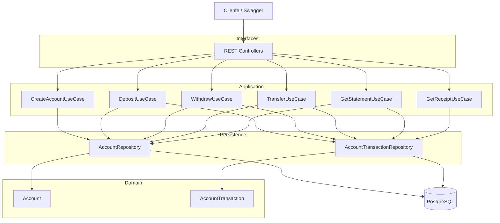
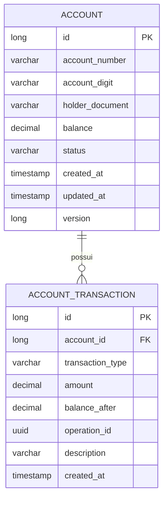

# 💳 Bank Account API

API REST para gerenciamento de contas correntes desenvolvida como solução para o desafio técnico.

O projeto foi implementado utilizando **Java 21**, **Spring Boot 3.5**, **PostgreSQL** e **Hibernate**, adotando uma abordagem baseada em **Clean Architecture simplificada** e princípios de **Domain-Driven Design (DDD)**.

O objetivo da solução é fornecer uma API segura para operações financeiras, garantindo integridade transacional, consistência dos dados e suporte à concorrência.

---

# Funcionalidades

A API disponibiliza os seguintes serviços:

- ✅ Abertura de conta corrente
- ✅ Depósito
- ✅ Saque
- ✅ Transferência entre contas
- ✅ Consulta de extrato com paginação
- ✅ Consulta de comprovante por operação

---

# Tecnologias

| Tecnologia | Versão |
|------------|---------|
| Java | 21 |
| Spring Boot | 3.5.x |
| Spring Data JPA | 3.5.x |
| Hibernate | 6.x |
| PostgreSQL | 17 |
| Maven | 3.9+ |
| Docker | Latest |
| Podman | Latest |
| SpringDoc OpenAPI | Latest |

---

# Arquitetura

A aplicação Bank Account API foi projetada para rodar localmente e também foi realizado testes em um ambiente containerizado utilizando Kubernetes, com suporte a auto scaling (HPA) e persistência em banco de dados PostgreSQL.

A imagem abaixo ilustra a arquitetura ideal base do sistema:


A api segue uma adaptação da **Clean Architecture**, organizada para manter baixo acoplamento e alta coesão, sem adicionar complexidade desnecessária ao escopo do desafio.

A responsabilidade da aplicação foi dividida em quatro camadas:

- **Controller** → exposição da API REST
- **Application** → casos de uso e orquestração das operações
- **Domain** → entidades, regras de negócio, enums e contratos
- **Infrastructure** → configurações técnicas e tratamento global de exceções

## Estrutura do projeto

```text
src/main/java
│
├── application
│   ├── dto
│   ├── mapper
│   └── usecase
│
├── domain
│   ├── enums
│   ├── exception
│   ├── model
│   └── repository
│
├── infrastructure
│   └── exception
│   └── configuration
│   └── validatiom
│
└── controller
```

---

# Arquitetura do sistema




---

# Decisões Arquiteturais

## Clean Architecture Simplificada

A solução foi estruturada utilizando princípios da Clean Architecture, porém de forma simplificada.

Como o desafio possui um domínio pequeno, optei por não criar camadas adicionais como Ports, Adapters específicos e interfaces para todos os casos de uso, evitando excesso de abstração e mantendo o código simples, legível e de fácil manutenção.

Essa decisão mantém a separação de responsabilidades sem aumentar a complexidade da aplicação.

---

## Domain-Driven Design (DDD)

Foram utilizados conceitos de **DDD** para manter o domínio como o centro da aplicação.

As entidades encapsulam seu próprio comportamento, evitando que regras de negócio fiquem espalhadas pelos serviços.

Exemplo:

- `deposit()`
- `withdraw()`
- `hasEnoughBalance()`

Os casos de uso apenas coordenam o fluxo da operação, enquanto o comportamento permanece dentro das entidades do domínio.

---

## Casos de Uso Independentes

Cada funcionalidade foi implementada em um Use Case específico:

- CreateAccountUseCase
- DepositUseCase
- WithdrawUseCase
- TransferUseCase
- GetStatementUseCase
- GetOperationReceiptUseCase

Essa organização facilita testes unitários, manutenção e futuras evoluções da aplicação.

---

# Modelo do Banco



---

A solução utiliza apenas duas tabelas:

### account

Representa o estado atual da conta corrente.

Contém informações como:

- identificador unico
- número da conta
- dígito verificador
- documento do cooperado
- saldo atual
- status
- versão da entidade
- data de criação e atualização

### account_transaction

Implementa um modelo baseado em **Ledger**.

Cada movimentação financeira gera um novo registro, preservando o histórico completo da conta e permitindo auditoria, emissão de extratos e rastreabilidade das operações.

Contém informações como:
- identificador unico
- identificador conta
- valor
- valor pós transação
- id da operação
- descrição opcional de uma transação
- data de criação

---

## Persistência

Foi adotado o padrão Repository utilizando Spring Data JPA.

Os repositórios abstraem o acesso aos dados, mantendo os casos de uso desacoplados da tecnologia de persistência.

---

## Controle Transacional

Todas as operações financeiras são executadas utilizando `@Transactional`.

Caso qualquer etapa da operação falhe, o Spring realiza rollback automaticamente, garantindo:

- Atomicidade
- Consistência
- Integridade dos dados

---

## Controle de Concorrência

Como operações financeiras alteram saldo, foi utilizado bloqueio pessimista (`PESSIMISTIC_WRITE`) durante a leitura das contas.

Essa estratégia impede que duas transações alterem simultaneamente o saldo da mesma conta, evitando perda de atualização em ambientes concorrentes.

---

## Controle de Versão da Entidade

A entidade `Account` utiliza o recurso de **Optimistic Locking** através da anotação `@Version`.

```java
@Version
private Long version;
```

O Hibernate incrementa automaticamente esse campo a cada atualização da conta.

Embora as operações financeiras utilizem bloqueio pessimista, o campo `version` foi mantido como uma camada adicional de proteção para futuras evoluções da aplicação, permitindo detectar alterações concorrentes realizadas por outros fluxos que não utilizem bloqueio pessimista.

---

## BigDecimal

Todos os valores monetários utilizam `BigDecimal`, evitando problemas de precisão inerentes aos tipos de ponto flutuante.

---

## Instant

Datas e horários são armazenados utilizando `Instant`, garantindo persistência em UTC e evitando problemas relacionados a fusos horários.

---

## OperationId

Cada operação financeira recebe um UUID (`operationId`).

Esse identificador permite agrupar todas as movimentações pertencentes à mesma operação de negócio, sendo utilizado na geração de comprovantes e auditoria das operações financeiras.

---

## Paginação

A consulta de extrato utiliza paginação através do `Pageable`, permitindo consultar contas com milhares de movimentações sem comprometer o consumo de memória da aplicação.

---

# Regras de Negócio

## Conta

- Número + Dígito únicos
- Documento do titular único
- Conta inicia ativa
- Saldo inicial igual a zero

## Depósito

- Valor deve ser maior que zero
- Atualiza saldo da conta
- Gera uma movimentação financeira

## Saque

- Valor deve ser maior que zero
- Não permite saldo negativo
- Gera uma movimentação financeira

## Transferência

- Contas de origem e destino devem ser diferentes
- Origem deve possuir saldo suficiente
- Executada dentro de uma única transação
- Gera duas movimentações:
    - TRANSFER_OUT
    - TRANSFER_IN
- Ambas compartilham o mesmo `operationId`

## Extrato

Permite:

- Paginação
- Filtro por período
- Filtro por tipo de movimentação

## Comprovante

Permite consultar uma operação através do `operationId`, retornando todas as movimentações relacionadas àquela operação.

---

# Testes

Foram implementados testes para:

- Criação de conta
- Depósito
- Saque
- Transferência
- Extrato
- Comprovante
- Concorrência
- Rollback transacional

---

# 🚀 Executando o Projeto

📍 Pré-requisitos
Java 21+
Maven 3.9+
Docker
Kubernetes (opcional)

💻 Execução Local

1. Clonar o projeto
- git clone https://github.com/seu-usuario/bank-account-api.git
- cd Bank-Account-Api

3. Subir banco
- docker compose up -d

3. Rodar aplicação
- mvn spring-boot:run

🌐 Acesso

API: http://localhost:8080

Swagger: http://localhost:8080/swagger-ui/index.html

☸️ Kubernetes

A aplicação inclui manifests completos para deploy.

- Componentes
- Deployment da API
- Deployment do PostgreSQL
- Services
- HPA (autoscaling)
- Configurations (CPU/memory)

Deploy
- mvn clean package
- docker build -t bank-account-api:latest .
- kubectl apply -f k8s/

Verificação
- kubectl get pods
- kubectl get svc
- kubectl get hpa

Acesso
- http://localhost:"node-port"

📈 Escalabilidade

A aplicação é stateless, permitindo:

- múltiplas réplicas
- autoscaling via HPA
- alta concorrência

Controle de consistência via:

- locks pessimistas
- transações
- ledger imutável

---

# Endpoints

| Método | Endpoint | Descrição |
|---------|----------|-----------|
| POST | `/accounts` | Abertura de conta |
| POST | `/transactions/deposit` | Realiza depósito |
| POST | `/transactions/withdraw` | Realiza saque |
| POST | `/transactions/transfer` | Realiza transferência |
| GET | `/transactions/{accountId}/statement` | Consulta extrato |
| GET | `/transactions/receipt/{operationId}` | Consulta comprovante |

# Exemplos de uso da API

👤💳 Criar conta 
`curl --location 'http://localhost:8080/accounts' \
--header 'Content-Type: application/json' \
--data '{
    "accountNumber": "3405417356",
    "accountDigit": "0",
    "holderDocument": "47255303013"
}'`

💰 Depósito
`curl -X POST http://localhost:8080/transactions/deposits \
  -H "Content-Type: application/json" \
  -d '{
    "accountId": 1,
    "amount": 100.00
  }'`
  
💸 Saque
`curl -X POST http://localhost:8080/transactions/withdrawals \
  -H "Content-Type: application/json" \
  -d '{
    "accountId": 1,
    "amount": 50.00
  }'`
  
🔁 Transferência
`curl -X POST http://localhost:8080/transactions/transfers \
  -H "Content-Type: application/json" \
  -d '{
    "fromAccountId": 1,
    "toAccountId": 2,
    "amount": 30.00
  }'`
  
📊 Extrato
`curl --location 'http://localhost:8080/transactions/1/statement?startDate=2026-06-26T23:40:21.274197Z&endDate=2026-12-29T23:48:53.425395Z&transactionType=TRANSFER_IN&size=2&page=1' \
--data ''`

🧾 Buscar comprovante
`curl -X GET http://localhost:8080/transactions/{operationId}/receipt`

---

# Logs

A aplicação possui configuração de logs estruturados utilizando **Logback**, com formatação padronizada para facilitar rastreabilidade, debugging e observabilidade em ambiente local e Kubernetes.

# Melhorias Futuras

Embora não façam parte do escopo do desafio, a arquitetura foi planejada para suportar futuras evoluções, como:

- JWT / OAuth2
- Redis cache
- Kafka / RabbitMQ
- Observabilidade (Prometheus + Grafana)
- Auditoria avançada
- Pipelines (CI/CD)
- Resiliência (Circuit Breaker)

---

# Autor

**Rafael Bernardinelli**
